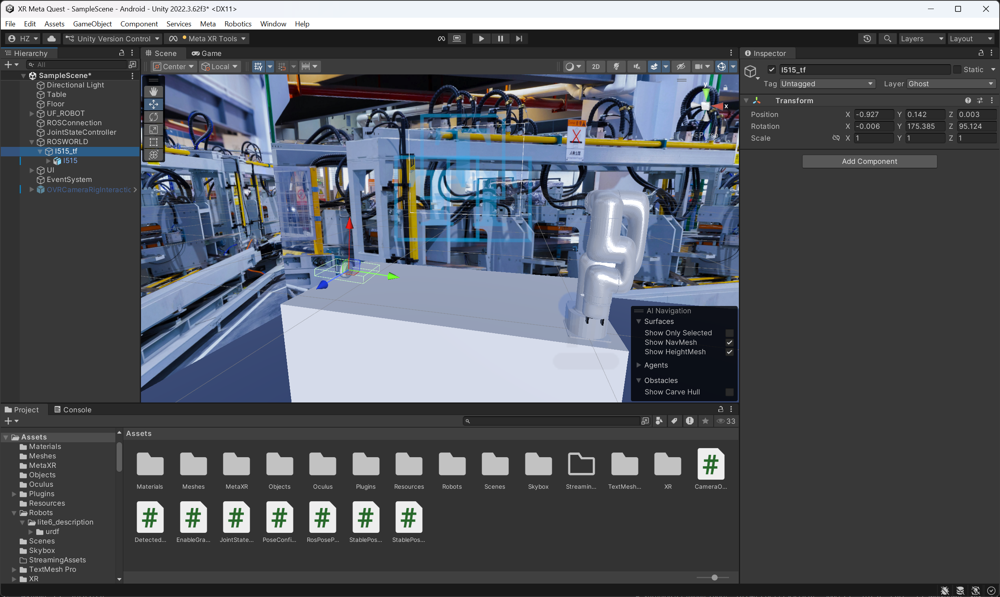

# Sistema de Teleoperación en Unity (XR Meta Quest)

Este proyecto Unity corresponde a la interfaz de teleoperación en realidad virtual del sistema robótico, encargada de la visualización del entorno, la interacción del usuario y la definición de objetivos de manipulación.

El sistema Unity se encuentra sincronizado espacialmente con el sistema ROS 2 mediante transformaciones obtenidas a partir de TFs publicados en ROS.

---
### Requisitos del entorno

Para poder utilizar y modificar el proyecto de teleoperación en Unity es necesario contar con el siguiente entorno mínimo:

- **Unity Hub** instalado.
- **Unity Editor versión 2022.3.62f3 (LTS)**.

> **Nota:**  
> El proyecto fue desarrollado y probado exclusivamente con la versión **Unity 2022.3.62f3**.  
> El uso de versiones distintas del editor puede provocar incompatibilidades con paquetes XR, configuraciones de render o scripts del proyecto.

La instalación del editor debe realizarse a través de **Unity Hub**, seleccionando explícitamente la versión indicada.


### Posicionamiento y orientación de la cámara

Para garantizar coherencia espacial entre el entorno real, el sistema ROS 2 y la escena de Unity, la posición y orientación de la cámara virtual se configuran utilizando información proveniente directamente de ROS.

La pose de la cámara se obtiene desde ROS 2 mediante el siguiente comando:
```
ros2 run tf2_ros tf2_echo link_base camera_link
```

Este comando permite consultar en tiempo real la transformación entre el frame base del robot (`link_base`) y el frame de la cámara (`camera_link`).

---

### Datos obtenidos desde ROS 2

El resultado del comando proporciona la información de traslación y rotación de la cámara en distintos formatos.  
A continuación se muestra un ejemplo real de salida:
```
Translation: [-0.003, -0.927, 0.142]
Rotation: in Quaternion (xyzw) [-0.030, 0.737, 0.674, -0.027]
Rotation: in RPY (radian) [1.660, 0.000, -3.061]
Rotation: in RPY (degree) [95.124, 0.006, -175.385]
```

Donde:
- **Translation** representa la posición de la cámara respecto a `link_base`.
- **Quaternion (xyzw)** representa la orientación de la cámara en forma de cuaternión.
- **RPY** corresponde a la orientación expresada como ángulos Roll, Pitch y Yaw.

---
---

## Configuración manual de la cámara en Unity

<p align="center">
  
</p>

La imagen anterior muestra la ubicación y orientación correcta del objeto de cámara dentro de la escena de Unity, así como los valores configurados en el panel **Inspector**.

En la escena principal (`SampleScene`), la cámara está representada por el objeto:

### Uso de la pose de la cámara en Unity

Los valores obtenidos desde ROS se utilizan para posicionar y orientar el objeto de cámara dentro de la escena de Unity, asegurando que la vista del usuario en realidad virtual coincida con la perspectiva del sistema de percepción.

En Unity:
- La **posición** de la cámara se establece directamente a partir del vector de traslación.
- La **orientación** se ajusta utilizando los ángulos RPY (en grados) o el cuaternión, considerando las diferencias entre los sistemas de coordenadas de ROS y Unity.

Esta sincronización es fundamental para:
- Mantener coherencia espacial entre la percepción y la visualización.
- Garantizar una correcta interpretación de las poses de los objetos.
- Permitir una interacción precisa del usuario con el entorno virtual durante la teleoperación.

---

---

### Aplicación de la pose en Unity

Los valores obtenidos desde ROS se introducen manualmente en el componente **Transform** del objeto de cámara dentro del **Inspector** de Unity.

#### Posición (Transform → Position)

Debido a las diferencias entre los sistemas de coordenadas de ROS y Unity, es necesario realizar un mapeo de ejes.

**Para la traslación**

| ROS | Unity |
|-----|-------|
| X   | -Z     |
| Y   | X     |
| Z   | Y     |

**Para la rotación euler**

| ROS | Unity |
|-----|-------|
| X   | Z     |
| Y   | -X     |
| Z   | Y     |


---


La correcta alineación inicial de la cámara es un paso crítico para el funcionamiento adecuado del sistema de teleoperación.

---

## Escena principal

La escena principal del proyecto (`SampleScene`) contiene:
- El entorno industrial virtual.
- El modelo del manipulador robótico.
- El objeto de cámara alineado con la pose obtenida desde ROS.
- Los elementos de interacción necesarios para la teleoperación en XR.

La correcta configuración inicial de la cámara garantiza coherencia espacial, correcta interpretación de las poses y una interacción precisa del usuario durante la teleoperación.
