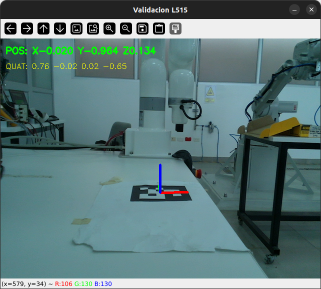
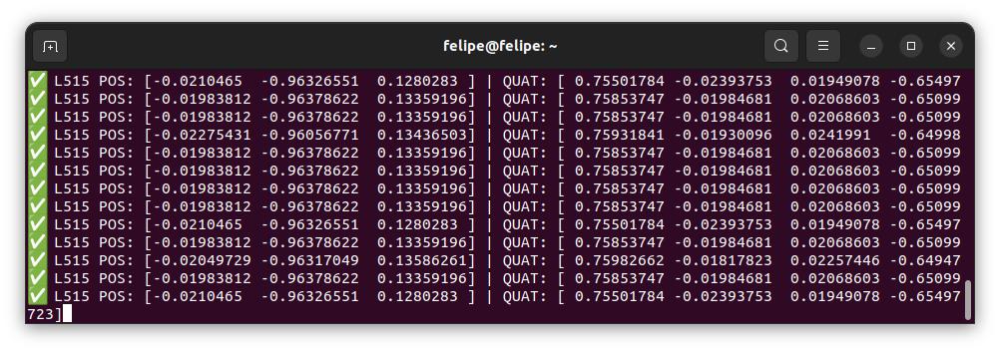
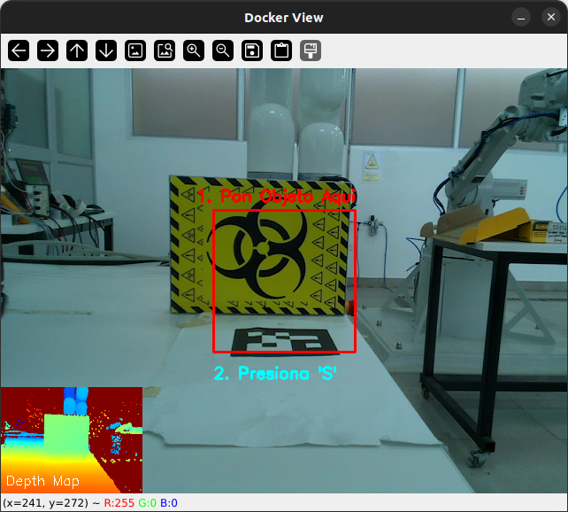
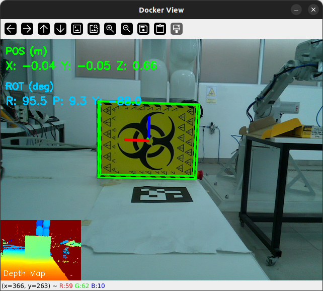

# 👁️ Módulo de Percepción y Visión (FoundationPose + RealSense L515)

Este directorio contiene la implementación del sistema de percepción basado en **FoundationPose** para el rastreo de objetos 6D (6-DoF) utilizando una cámara LiDAR **Intel RealSense L515**. El sistema opera mediante una arquitectura híbrida **Host-Docker**, comunicándose vía **ZeroMQ** y **ROS 2 Humble**.

---

## ⚙️ Especificaciones del Entorno (Setup)

El proyecto ha sido validado estrictamente bajo la siguiente configuración. Se recomienda replicarla para evitar errores de compatibilidad, especialmente con los drivers de la cámara.

* **Sistema Operativo:** Ubuntu 22.04 LTS
* **Kernel:** Linux 6.8 (Requiere instalación especial del SDK de RealSense)
* **GPU:** NVIDIA GeForce (Drivers actualizados + NVIDIA Container Toolkit)
* **Cámara:** Intel RealSense L515 (Firmware actualizado)
* **Software Base:**
    * ROS 2 Humble
    * Docker + Docker Compose
    * Conda (Miniconda/Anaconda)
    * Python 3.10+

---

## 📂 Estructura del Proyecto

Se sugiere la siguiente organización de archivos para este módulo:

```text
vision_module/
├── config/
│   ├── cyclonedds.xml          # Configuración de red para ROS 2
├── scripts_host/
│   ├── fp_host_bridge.py       # Puente Host <-> Docker <-> ROS 2
│   ├── aruco_calib.py          # Script para calibración cámara
│   └── data_collector_host.py  # (Opcional) Captura de datos para nuevos objetos
├── scripts_docker/
│   ├── fp_estimator_docker.py  # Estimador principal (Corre dentro del Docker)
│   └── train_my_object.py      # (Opcional) Reconstrucción 3D (BundleSDF)
└── README.md                   # Este archivo
```


## 🛠️ Guía de Instalación

### 1. Intel RealSense SDK 2.0 (Backend RSUSB)

Debido al uso del **Kernel 6.8** en Ubuntu 22.04, los drivers nativos (V4L) suelen fallar. Instalaremos el SDK compilando desde la fuente forzando el backend RSUSB.

**1. Instalar dependencias**

```bash
sudo apt update && sudo apt upgrade -y
sudo apt install git wget cmake build-essential libssl-dev libusb-1.0-0-dev libudev-dev pkg-config libgtk-3-dev libglfw3-dev libgl1-mesa-dev libglu1-mesa-dev at

```

**2. Clonar repo (Versión verificada 2.54.2)**

```bash
git clone -b v2.54.2 [https://github.com/IntelRealSense/librealsense.git](https://github.com/IntelRealSense/librealsense.git)
cd librealsense

```

**3. Compilar con flag RSUSB (CRÍTICO)**

```bash
mkdir build && cd build
cmake ../ -DFORCE_RSUSB_BACKEND=true -DCMAKE_BUILD_TYPE=Release -DBUILD_EXAMPLES=true -DBUILD_GRAPHICAL_EXAMPLES=true
make -j$(($(nproc)-1))
sudo make install

```

**4. Configurar Reglas Udev**

```bash
cd ..
sudo cp config/99-realsense-libusb.rules /etc/udev/rules.d/
sudo udevadm control --reload-rules && sudo udevadm trigger

```

> **Verificación:** Reinicia y ejecuta `realsense-viewer`. Deberías ver el stream de la L515.

### 2. Librería Python (Host)

En el entorno Conda del Host:

```bash
pip install pyrealsense2==2.54.2.5684

```

### 3. FoundationPose (Docker)

Utilizamos una imagen Docker con CUDA habilitado.

```bash
# Descargar imagen oficial (o custom para RTX 4090 si aplica)
docker pull wenbowen123/foundationpose && docker tag wenbowen123/foundationpose foundationpose

# Iniciar contenedor (montando la carpeta actual)
cd vision_module/
bash docker/run_container.sh

```

**⚠️ Paso Crítico (Primer inicio):** Dentro del Docker, se deben compilar las extensiones C++ de BundleSDF.

```bash
# Dentro del docker
bash build_all.sh

```

---

## 📖 Manual de Usuario y Ejecución

El sistema requiere ejecutar procesos en paralelo en el **Host** (Manejo de HW y ROS) y en el **Docker** (Inferencia IA).

### Paso 0: Calibración Extrínseca (Solo si se movió la cámara)

Antes de operar, debemos saber dónde está la cámara respecto a la base del robot.

1. Imprima un marcador ArUco (ID 0).
2. Mida la distancia física desde el origen del robot (`base_link`) hasta el centro del ArUco.
3. Edite las variables `MANUAL_OFFSET_POS` en el script de abajo y ejecútelo en una terminal con conda activado.

**Ejecución:** 

```bash
#En una terminal nueva (fuera del docker)
python3 scripts_host/aruco_calib.py
```

**Resultado esperado:**
El script imprimirá una línea como:
`✅ L515 POS: [0.01 0.2 0.5] | QUAT: [0.0 0.0 0.707 0.707]`

Guarde estos valores para el `static_transform_publisher` en ROS 2.

<div align="center">


</div>

---

### Paso 1: Iniciar el Puente (HOST)

Este script lee la cámara, envía las imágenes al Docker por ZMQ y publica el resultado en ROS 2.

**Requisitos previos:**

* Verificar IP del host (`hostname -I`) y editar `config/cyclonedds.xml` si cambió la red.
* Conectar la cámara L515 al puerto USB 3.0.

**Ejecución:**

```bash
# En una terminal nueva (fuera del docker)
conda activate su_entorno
export RMW_IMPLEMENTATION=rmw_cyclonedds_cpp
export CYCLONEDDS_URI=file:///ruta/absoluta/a/vision_module/config/cyclonedds.xml
export ROS_DOMAIN_ID=30
source /opt/ros/humble/setup.bash

python3 scripts_host/fp_host_bridge.py

```

**Salida esperada:**

```text
[INFO] ... 🚀 Bridge Iniciado. Publicando en /foundation_pose/pose
📡 ZMQ: Enviando imágenes en :5555 | Escuchando poses de :5556
Message: L515 configurada en Short Range Preset
📷 RealSense Iniciada.

```

---

### Paso 2: Iniciar el Estimador (DOCKER)

Este script recibe las imágenes, corre la red neuronal y devuelve la pose.

**Ejecución:**

```bash
# 1. Entrar al contenedor
bash docker/run_container.sh

# 2. (IMPORTANTE) Limpiar y recompilar utilidades de BundleSDF si hubo cambios o reinicio
cd bundlesdf/mycuda
rm -rf build *egg* *.so
python -m pip install -e .
cd ../..

# 3. Ejecutar estimador
python3 scripts_docker/fp_estimator_docker.py

```

**Interacción:**

1. Se abrirá una ventana mostrando el video.
2. Encuadre el objeto en el rectángulo guía.
3. Presione la tecla **'S'** para iniciar el tracking.

<div align="center">


</div>

---

## Anexo: Entrenamiento de Nuevos Objetos

Si desea rastrear un objeto propio (no incluido en los demos), siga este flujo.

> **Nota:** No se recomiendan objetos muy pequeños (< 3cm).

### A. Recolección de Datos (Host)

Use el script `data_collector_host.py`. Necesitará el marcador ArUco junto al objeto para registrar la pose base.

* **Espacio:** Guarda un frame.
* **Q:** Salir.

Esto generará carpetas `rgb`, `depth`, `masks`, `cam_in_ob` en `demo_data/`.

### B. Reconstrucción 3D (Docker)

Use el script `train_my_object.py` dentro del Docker. Este script incluye un **fix de escala para la L515** (dividiendo la profundidad raw por 4000.0).

```bash
# Dentro del Docker
python3 scripts_docker/train_my_object.py

```

**Salida:** Un archivo `.obj` y `.mtl` en la carpeta del objeto.

> **Nota:** Asegúrese de verificar el modelo resultante en MeshLab antes de usarlo, puede ver la carpeta de ejemplo en /docs/cracker_dataset

```
```
